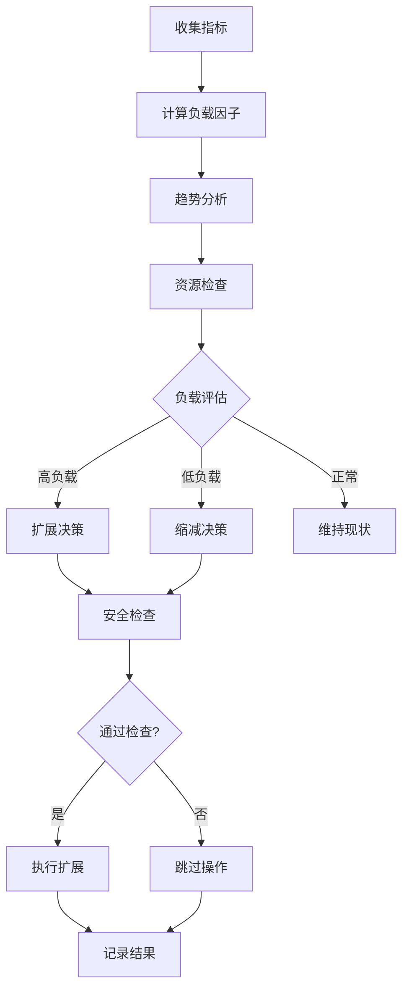

# 🧠 实时自适应消费者扩展系统使用指南

## 📋 系统概述

实时自适应消费者扩展系统是一个**非侵入式**的智能管理器，能够：

- 🔍 **实时监控**：持续监控Redis Stream负载、系统资源、应用性能
- 🧠 **智能决策**：基于负载趋势、资源状况自动制定扩展策略
- ⚡ **自动执行**：通过现有API安全地执行扩展操作
- 🛡️ **安全机制**：多重安全检查，防止过度扩展和系统不稳定

## 🏗️ 系统架构

```
┌─────────────────────────────────────────────────────────────┐
│                   自适应消费者管理器                          │
├─────────────────┬─────────────────┬─────────────────────────┤
│   监控层         │   决策层         │   执行层                 │
│                 │                 │                         │
│ • Redis Stream  │ • 智能决策引擎   │ • 现有API调用           │
│   指标监控       │ • 负载分析算法   │ • 渐进式执行            │
│ • 系统资源监控   │ • 趋势预测模型   │ • 回滚机制              │
│ • 性能指标收集   │ • 安全阈值检查   │ • 错误处理              │
└─────────────────┴─────────────────┴─────────────────────────┘
                            │
                            ▼
                    ┌─────────────────┐
                    │   现有系统       │
                    │ • StreamManager │
                    │ • API路由       │
                    │ • 消费者组      │
                    └─────────────────┘
```

## 🚀 快速开始

### 1. 启动自适应管理

```bash
# 通过API启动
curl -X POST "http://localhost:8000/api/v1/diagnosis-stream/adaptive/start" \
     -H "Authorization: Bearer $TOKEN"
```

**响应示例：**
```json
{
  "status": "success",
  "message": "实时自适应消费者管理已启动",
  "features": [
    "智能负载监控",
    "自动扩展决策", 
    "趋势分析预测",
    "资源安全检查",
    "非侵入式执行"
  ],
  "config": {
    "monitoring_interval": 15,
    "max_consumers_per_fault": 15,
    "cpu_safe_threshold": 70.0,
    "memory_safe_threshold": 80.0
  }
}
```

### 2. 查看实时状态

```bash
# 获取运行统计
curl -X GET "http://localhost:8000/api/v1/diagnosis-stream/adaptive/stats" \
     -H "Authorization: Bearer $TOKEN"
```

**响应示例：**
```json
{
  "status": "success",
  "data": {
    "status": "running",
    "uptime_seconds": 1800,
    "statistics": {
      "total_scaling_operations": 5,
      "successful_scale_ups": 3,
      "successful_scale_downs": 2,
      "prevented_operations": 2
    },
    "recent_metrics": {
      "latest_cpu_usage": 65.2,
      "latest_memory_usage": 72.1,
      "latest_throughput": 1250.5
    },
    "recent_decisions": [
      {
        "fault_type": "bearing",
        "action": "scale_up",
        "confidence": 0.85,
        "reasoning": ["高负载检测", "上升趋势检测", "系统资源充足"]
      }
    ]
  }
}
```

## ⚙️ 配置管理

### 默认配置

```python
class AdaptiveConfig:
    # 监控配置
    monitoring_interval: int = 15  # 15秒监控间隔
    metrics_history_size: int = 100  # 保留100个历史指标
    
    # 扩展阈值
    high_load_threshold: float = 0.8  # 80%高负载阈值
    low_load_threshold: float = 0.3   # 30%低负载阈值
    cpu_safe_threshold: float = 70.0  # 70% CPU安全阈值
    memory_safe_threshold: float = 80.0  # 80%内存安全阈值
    
    # 扩展策略
    max_consumers_per_fault: int = 15  # 每种故障最大15个消费者
    min_consumers_per_fault: int = 2   # 每种故障最小2个消费者
    scale_step_size: int = 2           # 每次扩展2个消费者
    
    # 安全机制
    max_scale_operations_per_hour: int = 6  # 每小时最大6次操作
    cooldown_period_minutes: int = 10       # 10分钟冷却期
```

### 动态调整配置

```bash
# 更新配置
curl -X PUT "http://localhost:8000/api/v1/diagnosis-stream/adaptive/config" \
     -H "Authorization: Bearer $TOKEN" \
     -H "Content-Type: application/json" \
     -d '{
       "monitoring_interval": 10,
       "high_load_threshold": 0.75,
       "max_consumers_per_fault": 20,
       "cpu_safe_threshold": 75.0
     }'
```

## 🧠 智能决策机制

### 决策流程



### 决策因素

1. **负载因子计算**
   ```python
   load_factor = (pending_messages / consumers * 0.7 + throughput_factor * 0.3) / 100
   ```

2. **趋势分析**
   - 基于最近10个数据点的线性回归
   - 正值表示上升趋势，负值表示下降趋势

3. **资源可用性**
   - CPU使用率 < 70%
   - 内存使用率 < 80%
   - Redis延迟 < 100ms

4. **置信度评分**
   - 高负载 + 上升趋势 + 资源充足 = 高置信度扩展
   - 低负载 + 下降趋势 = 高置信度缩减

## 📊 监控和诊断

### 查看决策历史

```bash
# 获取最近20个决策
curl -X GET "http://localhost:8000/api/v1/diagnosis-stream/adaptive/decisions/history?limit=20" \
     -H "Authorization: Bearer $TOKEN"

# 按故障类型过滤
curl -X GET "http://localhost:8000/api/v1/diagnosis-stream/adaptive/decisions/history?fault_type=bearing" \
     -H "Authorization: Bearer $TOKEN"
```

### 模拟决策测试

```bash
# 模拟高负载场景
curl -X POST "http://localhost:8000/api/v1/diagnosis-stream/adaptive/simulate" \
     -H "Authorization: Bearer $TOKEN" \
     -d "fault_type=bearing&pending_messages=5000&cpu_usage=60.0&memory_usage=65.0"
```

**响应示例：**
```json
{
  "status": "success",
  "data": {
    "simulation_input": {
      "fault_type": "bearing",
      "pending_messages": 5000,
      "cpu_usage": 60.0,
      "memory_usage": 65.0
    },
    "decision": {
      "action": "scale_up",
      "current_count": 2,
      "target_count": 4,
      "confidence": 0.8,
      "reasoning": ["高负载检测 (负载因子: 0.85)", "系统资源充足"],
      "priority": 8,
      "estimated_impact": {
        "throughput_improvement": 0.6,
        "latency_reduction": 0.48,
        "resource_increase": 0.2
      }
    }
  }
}
```

## 🛡️ 安全机制

### 1. 冷却期保护
- 每个故障类型扩展后有10分钟冷却期
- 防止频繁调整导致系统不稳定

### 2. 频率限制
- 每小时最多6次扩展操作
- 超过限制自动跳过后续操作

### 3. 置信度检查
- 决策置信度 < 0.6 时跳过执行
- 确保只在高确定性时执行扩展

### 4. 资源保护
- CPU使用率 > 70% 时拒绝扩展
- 内存使用率 > 80% 时拒绝扩展

### 5. 紧急停止
- 连续5次监控错误自动停止
- 错误率 > 10% 触发紧急停止

## 📈 性能优化建议

### 1. 监控间隔调整
```bash
# 高负载环境：更频繁监控
{
  "monitoring_interval": 10
}

# 稳定环境：降低监控频率
{
  "monitoring_interval": 30
}
```

### 2. 阈值调整
```bash
# 敏感扩展：更低的阈值
{
  "high_load_threshold": 0.6,
  "low_load_threshold": 0.2
}

# 保守扩展：更高的阈值
{
  "high_load_threshold": 0.9,
  "low_load_threshold": 0.4
}
```

### 3. 扩展步长优化
```bash
# 快速响应：更大步长
{
  "scale_step_size": 3
}

# 平滑扩展：更小步长
{
  "scale_step_size": 1
}
```

## 🔧 故障排除

### 常见问题

#### 1. 自适应管理器启动失败
```bash
# 检查Redis连接
redis-cli ping

# 检查API认证
curl -X POST "http://localhost:8000/auth/token" \
     -d '{"username": "user1", "password": "password123"}'
```

#### 2. 决策不执行
- 检查冷却期状态
- 验证资源阈值设置
- 确认置信度是否达标

#### 3. 扩展操作失败
- 检查现有API是否正常
- 验证故障类型参数
- 查看系统日志错误信息

### 日志监控
```bash
# 查看自适应管理器日志
tail -f logs/app.log | grep "adaptive"

# 关键日志标识
# 🧠 - 初始化相关
# 🎯 - 决策执行
# ⚠️ - 警告信息
# ❌ - 错误信息
```

## 🔄 运维操作

### 启动流程
1. 确保Redis服务正常
2. 启动后端API服务
3. 调用启动API
4. 验证监控状态

### 停止流程
```bash
# 优雅停止
curl -X POST "http://localhost:8000/api/v1/diagnosis-stream/adaptive/stop" \
     -H "Authorization: Bearer $TOKEN"
```

### 健康检查
```bash
# 定期检查状态
curl -X GET "http://localhost:8000/api/v1/diagnosis-stream/adaptive/stats" \
     -H "Authorization: Bearer $TOKEN" | jq '.data.status'
```

## 📝 最佳实践

### 1. 渐进式部署
- 先在测试环境验证
- 从保守配置开始
- 逐步调整参数

### 2. 监控配置
- 设置合理的监控间隔
- 保留足够的历史数据
- 定期检查决策质量

### 3. 安全配置
- 设置合适的资源阈值
- 配置适当的冷却期
- 限制扩展操作频率

### 4. 性能调优
- 根据业务特点调整阈值
- 优化扩展步长
- 监控系统资源使用

## 🎯 总结

实时自适应消费者扩展系统提供了：

✅ **非侵入式设计** - 不修改现有架构，通过API集成
✅ **智能决策** - 基于多维度指标的智能分析
✅ **安全可靠** - 多重保护机制，防止系统不稳定
✅ **实时响应** - 15秒监控间隔，快速响应负载变化
✅ **可配置** - 丰富的配置选项，适应不同场景
✅ **可观测** - 详细的统计信息和决策历史

通过这个系统，您可以实现真正的**实时自适应扩展**，让消费者数量始终与系统负载保持最优匹配！ 